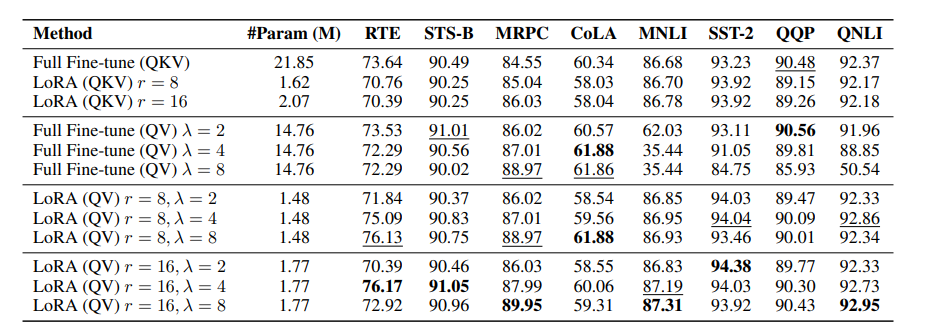
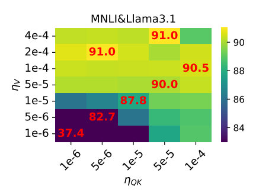

# LightweightAtt

This repository contains code for the paper： 

Theoretical Insights into Fine-Tuning Attention Mechanism: Generalization and Optimization

## Requirements

To install the experiment, please install the pip file. 

```setup
pip install -r requirements.txt
```

## **Get Dataset**

```
data_download.py
```

## **Run a sample code**

At the moment, each experiment is its own file. You can run the following example:

```
chmod +x xxx.sh  #ensure execute permissions
```

```eval
LightweightAtt\sh\llama3.1-8b-lora.sh
```

>📋  You can modify some parameter settings in the code to conduct different experiments.
>
>task=mnli   #Task type   glue_tasks = {"cola", "mnli", "mrpc", "qnli", "qqp", "rte", "sst2", "stsb"}
>
>lr=5e-5  #The learning rate for Q,K    ($\eta_{QK}$)
>
>lr_ratio=2.5  #The ratio  of $\eta_V/\eta_{QK}=\lambda$  
>
>target=q_proj,k_proj,v_proj   #The target fine-tuning weights


## Contributing

>📋  In this paper, we investigate two remarkable phenomena observed during the fine-tuning of LLMs, particularly focusing on the attention mechanism: (1) Different Impact, optimizing the $\mathbf{W}_v$ matrix significantly improves performance over optimizing the $\mathbf{W}_k$ matrix. Fine-tuning only the $\mathbf{W}_q$ and $\mathbf{W}_v$ matrices is computationally efficient, delivering results that are comparable to, or even better than, fine-tuning all three matrices $\mathbf{W}_q$, $\mathbf{W}_k$, and $\mathbf{W}_v$. (2) Efficient Convergence, employing distinct learning rates for these matrices is crucial for optimal performance, with a higher learning rate for the $\mathbf{W}_v$ matrix expediting convergence. However, theoretical analyses of these phenomena are still relatively limited. We present a theoretical analysis of these phenomena from two perspectives: (i) Generalization, where we demonstrate that fine-tuning only $\mathbf{W}_q$ and $\mathbf{W}_v$ improves generalization bounds, enhances memory efficiency, and (ii) Optimization, where we emphasize that the feature learning of the attention mechanism is efficient, particularly when using distinct learning rates for the matrices, which leads to more effective fine-tuning. Building on these insights, we propose a new strategy that improves fine-tuning efficiency in terms of both storage and time. Experimental results on benchmark datasets validate the effectiveness of this approach, supporting our theoretical findings. Our analysis lays the theoretical groundwork for configuring and improving lightweight algorithms in LLMs fine-tuning.




